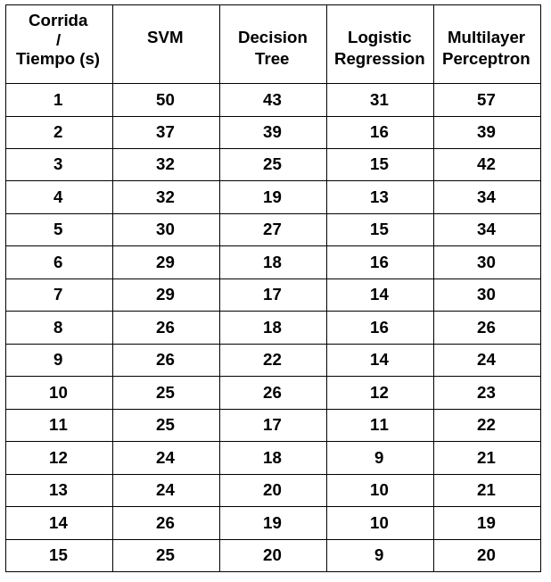

**TECNOLÓGICO NACIONAL DE MÉXICO**

**INSTITUTO TECNOLÓGICO DE TIJUANA**

**SUBDIRECCIÓN ACADÉMICA**
**PARTAMENTO DE SISTEMAS Y COMPUTACIÓN**

**CARRERA**

Ingeniería en Sistemas Computacionales

**MATERIA** 

Datos Masivos

**TÍTULO**

Final Proyect

**UNIDAD**

IV

**ALUMNO Y NO. DE CONTROL**

Castro Cebreros Alejandro 16211341

Reyes Armenta Gerardo Antonio 17211147

**MAESTRO**
Christian Romero Hernandez

## Introducción 
En este documento se verá a detalle sobre cuatro algoritmos de machine learning, SVM, Decision Tree, Logistic Regression y Multiplayer perceptron. Se mostrará la información de cada uno y su implementación para poder comparar y analizar el rendimiento que tiene cada uno, utilizando el dataset del siguiente link https://archive.ics.uci.edu/ml/datasets/Bank+Marketing.

## Marco de teórico 
Machine learning
Es un área de la inteligencia artificial que engloba un conjunto de técnicas que hacen posible el aprendizaje automático a través del entrenamiento con grandes volúmenes de datos. Hoy en día existen diferentes modelos que utilizan esta técnica y consiguen una precisión incluso superior a la de los humanos en las mismas tareas, por ejemplo en el reconocimiento de objetos en una imagen. La construcción de modelos de Machine Learning requiere adaptaciones propias debido a la naturaleza de los datos o a la problemática a la que se aplica. Así, surge la necesidad de investigar las diferentes técnicas que permitan obtener resultados precisos y confiables en un tiempo razonable.

Algunos sectores como el informático, salud, corporativo y de transporte. En el transcurso de las últimas décadas han encontrado la solución a esta ardua tarea de aprendizaje y predicción en una de las cuantas disciplinas procedentes de la inteligencia artificial; esta materia o herramienta informática es el machine learning. Herramienta que busca mejorar el análisis de datos, en pro de una predicción futura, ya sea por la implementación de nuevos sistemas o simplemente el mejoramiento de los ya existentes, mediante el uso de algoritmos basados en información antigua o reciente que permita el funcionamiento óptimo del sistema a trabajar. 

Machine learning es un subcampo de la Inteligencia Artificial que puede definirse como un proceso de descubrimiento y enriquecimiento del conocimiento en el que la máquina representada por algoritmos imita las técnicas de aprendizaje de humanos o animales y su comportamiento desde una perspectiva de pensamiento y respuesta; esto es posible gracias a la construcción de un programa informático, utilizando datos históricos, para resolver un determinado problema y mejorar de manera automática su eficiencia a través de la experiencia. Los algoritmos de machine learning facilitan que las computadoras construyan modelos, identificando patrones en los datos disponibles, y que automaticen el proceso de toma de decisiones basándose en la entrada de datos y en la experiencia. La mayor ventaja de incorporar estas técnicas es el aspecto de la automatización del enriquecimiento del conocimiento basado en técnicas de autoaprendizaje con una mínima intervención humana en el proceso. Los algoritmos más utilizados son: los árboles de decisión, las redes neuronales, Naive Bayes, los algoritmos de agrupamiento y los algoritmos genéticos.

Los algoritmos de machine learning se clasifican de acuerdo con el proceso de aprendizaje. Existen tres tipos:
Aprendizaje supervisado: En este tipo de aprendizaje se detalla cuál sería el resultado o respuesta esperada a partir del ingreso de un dato de entrada. Al proceso de emparejar un dato de entrada con su resultado esperado se le llama etiquetado. Los algoritmos que utilizan este proceso de aprendizaje son las redes neuronales, las redes bayesianas y los árboles de decisión.
Aprendizaje no supervisado: No se proporciona al algoritmo ninguna información o etiqueta sobre los datos disponibles y se le obliga a describir su estructura y la relación entre las variables. Los algoritmos que utilizan este proceso de aprendizaje son el agrupamiento K-means, la agrupación jerárquica y el análisis del componente principal.
Aprendizaje semi supervisado: En este proceso de aprendizaje se le proporciona al algoritmo un pequeño conjunto de datos etiquetados. Este proceso es utilizado cuando se sabe que un reducido número de variables condujo a un resultado, pero se desconoce el alcance total de las variables involucradas. Un caso especial de aprendizaje semi supervisado es el aprendizaje reforzado en el que un experto informa al algoritmo si su resultado es correcto o no. Los algoritmos que utilizan este proceso de aprendizaje son la maximización de expectativa, máquina de vector de apoyo transductivo y los procesos de decisión de Markov.

De acuerdo con el tipo de resultado. Se detallan los siguientes:
Clasificación: Estos algoritmos toman los datos etiquetados y generan modelos que clasifican los nuevos datos de acuerdo con lo aprendido. Los algoritmos utilizados para la clasificación son los bosques aleatorios, Naive Bayes, regresión logística y las redes neuronales convolucionales.
Agrupamiento o conglomeración: Los algoritmos buscan agrupar elementos similares dentro de un conjunto de datos. Los algoritmos de agrupamiento más utilizados son los K-means, los hereditarios y los basados en la densidad.
Regresión: Los algoritmos de regresión intentan generar un modelo predictivo optimizando el error en los datos aprendidos; ejemplo de esto son el algoritmo de mínimos cuadrados ordinarios y la regresión multivariable.
Detección de anomalías: Este algoritmo toma un conjunto de datos de elementos “normales” y aprende un modelo de normalidad, es utilizado para determinar si algún dato nuevo es anómalo o de baja probabilidad de producirse.

### SVM
Support Vector Machines: Busca la maximización de la distancia entre la recta o el plano y las muestras que se encuentran a un lado u otro. En el caso que las muestras no sean linealmente separables se utiliza una transformación llamada kernel.

Introducido por Cortes y Vapnik, estos clasificadores no solo han sido utilizados para solventar tareas de clasificación, sino también han sido utilizados para propósitos de regresión. El algoritmo marca cada dato en un espacio n-dimensional (donde n es el número de características) con el valor de cada característica como situado en una coordenada particular. Después, la clasificación se lleva a cabo encontrando el hiper-plano o hiper-planos que mejor diferencia las categorías.

Support Vector Machines (SVM) también se puede utilizar como método de regresión, manteniendo todas las características principales que caracterizan el algoritmo (margen máximo). La regresión basada en soporte vectorial (SVR) utiliza los mismos principios que SVM para la clasificación, con solo algunas diferencias menores

Margen de tolerancia

Minimización del error

Un SVM construye un hiperplano o un conjunto de hiperplanos en un espacio de dimensión alta o infinita, que se puede utilizar para clasificación, regresión u otras tareas. Intuitivamente, se logra una buena separación por el hiperplano que tiene la mayor distancia a los puntos de datos de entrenamiento más cercanos de cualquier clase (el llamado margen funcional), ya que en general, cuanto mayor es el margen, menor es el error de generalización del clasificador. LinearSVC en Spark ML admite la clasificación binaria con SVM lineal. Internamente, optimiza la pérdida de bisagra utilizando el optimizador OWLQN.

----
### Decision Tree

Un árbol de decisión es un modelo de predicción cuyo objetivo principal es el aprendizaje inductivo a partir de observaciones y construcciones lógicas. Son muy similares a los sistemas de predicción basados en reglas, que sirven para representar y categorizar una serie de condiciones que suceden de forma sucesiva para la solución de un problema. Constituyen probablemente el modelo de clasificación más utilizado y popular. El conocimiento obtenido durante el proceso de aprendizaje inductivo se representa mediante un árbol. Un árbol gráficamente se representa por un conjunto de nodos, hojas y ramas.

El nodo principal o raíz es el atributo a partir del cual se inicia el proceso de clasificación; los nodos internos corresponden a cada una de las preguntas acerca del atributo en particular del problema. Cada posible respuesta a los cuestionamientos se representa mediante un nodo hijo. Las ramas que salen de cada uno de estos nodos se encuentran etiquetadas con los posibles valores del atributo. Los nodos finales o nodos hoja corresponden a una decisión, la cual coincide con una de las variables clase del problema a resolver. Este modelo se construye a partir de la descripción narrativa de un problema, ya que provee una visión gráfica de la toma de decisión, especificando las variables que son evaluadas, las acciones que deben ser tomadas y el orden en el que la toma de decisión será efectuada. Cada vez que se ejecuta este tipo de modelo, solo un camino será seguido dependiendo del valor actual de la variable evaluada. Los valores que pueden tomar las variables para este tipo de modelos pueden ser discretos o continuos. 

La inducción de árboles de decisión ofrece un método muy práctico para generalizar a partir de ejemplos cuya pertenencia a una clase es conocida.  El enfoque más común para inducir un árbol de decisión es dividir los ejemplos etiquetados recursivamente hasta que se cumpla un criterio de parada.  La partición se define seleccionando una prueba que tiene un pequeño conjunto de resultados, creando una rama para cada resultado posible, pasando cada ejemplo por la rama correspondiente, y tratando cada bloque de la partición como un subproblema, para el que se construye un subárbol recursivamente.

Los árboles de decisión crean un modelo de clasificación basado en diagramas de flujo. Clasifican casos en grupos o pronostican valores de una variable dependiente (criterio) basada en valores de variables independientes (predictoras). 

Las ventajas de un árbol de decisión son (Pérez, 2011): 

- Facilita la interpretación de la decisión adoptada. 
- Facilita la comprensión del conocimiento utilizado en la toma de decisiones. 
- Explica el comportamiento respecto a una determinada decisión. Reduce el número de variables independientes. 

Para ejemplificar de forma gráfica lo que es un árbol de decisión proponemos un sencillo ejemplo. Imaginemos que queremos conocer qué variables influyen primordialmente a la hora de aprobar el primer curso de Ingeniería Electrónica. Es decir, queremos conocer qué estudiantes matriculados de primer curso de esta carrera tienen más probabilidades de aprobar el conjunto de las asignaturas, y qué características están asociadas a este éxito académico. En este caso, la variable de interés (VD) es el rendimiento académico en el primer curso. Tras introducir los datos necesarios en el programa, este nos devuelve un diagrama que nos permite comprobar que la satisfacción con la carrera y las horas de estudio diarias son las variables que determinan principalmente el éxito académico de un estudiante. Aprueban, sobre todo, los estudiantes satisfechos con la carrera que cursan y, dentro de este grupo, los que dedican más horas al estudio. Es decir, si un estudiante de primer curso de Ingeniería Electrónica está satisfecho con la carrera y estudia más de tres horas diarias, entonces tiene una probabilidad de aprobar el conjunto del primer curso del 93%.

---
### Logistic Regression

La técnica de la regresión logística se originó en la década de los 60 con el trabajo de Cornfield, Gordon y Smith en 1967, Walter y Duncan la utilizan ya en la forma que la conocemos actualmente, o sea para estimar la probabilidad de ocurrencia de un proceso en función de ciertas variables. Su uso se incrementa desde principios de los 80 como consecuencia de los adelantos ocurridos en el campo de la computación. 

La regresión logística es el método más común utilizado para modelar datos de respuesta binaria. Cuando la respuesta es binaria, generalmente toma la forma de 1/0, donde 1 generalmente indica un éxito y 0 un fracaso. Sin embargo, los valores reales que pueden tomar 1 y 0 varían ampliamente, dependiendo del propósito del estudio. Por ejemplo, para un estudio de las probabilidades de reprobar en un entorno escolar, 1 puede tener el valor de reprobar y 0 de no reprobar, o aprobar. El punto importante es que 1 indica el primer tema de interés para el cual se diseña un estudio de respuesta binaria. Modelar una variable de respuesta binaria usando regresión lineal normal introduce un sesgo sustancial en las estimaciones de los parámetros. El modelo lineal estándar supone que los términos de respuesta y error tienen una distribución normal o gaussiana, que la varianza, σ2, es constante entre las observaciones y que las observaciones en el modelo son independientes. Se violan los supuestos anteriores. De manera análoga al modelo de regresión normal que se basa en la función de distribución de probabilidad gaussiana (pdf), un modelo de respuesta binaria se deriva de una distribución de Bernoulli, que es un subconjunto del binomio pdf con el denominador binomial tomando el valor de 1.

La regresión logística se utiliza cuando queremos investigar si una o varias variables explican una variable dependien­te que toma un carácter cualitativo. Este hecho es muy frecuente en medicina, ya que constantemente intentamos dar respuesta a preguntas formuladas con base en la presencia o ausencia de una determinada característica que no es cuantificable, sino que re­presenta la existencia o no de un efecto de interés, como por ejemplo el desarrollo de un «evento cardiovascular», «un paciente hospitalizado muere o no antes del alta», «se produce o no un reingreso», «un paciente desarrolla o no nefropatía diabética», etc. Una de las ventajas de la RL es que permite el ma­nejo de múltiples variables independientes (también llamadas covariables) con un número reducido de casos. Freeman (1987) ha sugerido que el número de sujetos debe ser superior a (10)(k+1), donde k es el número de covariables. Pero hay que tener en cuenta que el tamaño de la muestra necesaria es in­herente al tipo de estudio que se realiza.
Como hemos mencionado anteriormente la RL tiene una doble función: explicativa y predictiva.
Podemos usarla con finalidad descriptiva siendo po­sible ofrecer una descripción elocuente y útil, basándonos en una información reducida; un ejemplo clásico es cuando la probabilidad que se estima puede interpretarse como una tasa de prevalencia o de incidencia que dependa de una variable conti­nua. Aunque hay estudios que ejemplarizan este en­foque hay que reconocer que esta variante ha sido poco explotada.
Su utilización en la predicción es el uso más fre­cuente y extendido, enmarcado en los diferentes tipos de estudios, ya sean típicamente prospectivos con finalidad pronóstica (epidemiología clínica), estudios prospectivos con finalidad analítica (cohortes), estu­dios caso-control (riesgo atribuible) y en los ensayos clínicos. Quisiéramos en este punto resaltar que la RL es un instrumento muy útil para facilitar el tratamiento cuantitativo de los datos, pero no podemos aislarlo del diseño del estudio, so pena de cometer errores que nos conducirán a conclusiones erróneas.
Hay que destacar que además de predecir riesgos, la RL puede servir para estimar la fuerza de la aso­ciación de cada factor de riesgo de una manera independiente, es decir, eliminando la posibilidad de que un factor confunda el efecto de otro.
El objetivo de esta técnica estadística es expresar la probabilidad de que ocurra un hecho como función de ciertas variables, supongamos que son k (k ³ 1), que se consideran potencialmente influyentes. La regresión logística, al igual que otras técnicas estadísticas multivariadas, da la posibilidad de evaluar la influencia de cada una de las variables independientes sobre la variable respuesta y controlar el efecto del resto. Tendremos, por tanto, una variable dependiente, llamémosla Y, que puede ser dicotómica o politómica (en este trabajo nos referiremos solamente al primer caso) y una o más variables independientes, llamémosle X.
Al ser la variable Y dicotómica, podrá tomar el valor "O" si el hecho no ocurre y "1" si el hecho ocurre; el asignar los valores de esta manera o a la inversa es intrascendente, pero es muy importante tener en cuenta la forma en que se ha hecho llegado el momento de interpretar los resultados. Las variables independientes (también llamadas explicativas) pueden ser de cualquier naturaleza: cualitativas o cuantitativas. La probabilidad de que Y=1 se denotará por p.

---
### Multilayer perceptron

Los perceptrones multicapa (MLP) son redes neuronales de alimentación directa entrenadas con el algoritmo estándar de retropropagación.  Son redes supervisadas, por lo que requieren una respuesta deseada para ser entrenadas. Aprenden a transformar los datos de entrada en una respuesta deseada, por lo que se utilizan ampliamente para la clasificación de patrones.  Con una o dos capas ocultas, pueden aproximar prácticamente cualquier mapa de entrada-salida. Se ha demostrado que se aproximan al rendimiento de los clasificadores estadísticos óptimos en problemas difíciles.   La mayoría de las aplicaciones de redes neuronales incluyen MLP. Esta es quizás la arquitectura de red más popular en la actualidad. Cada unidad realiza una suma ponderada sesgada de sus entradas y pasa este nivel de activación a través de una función de transferencia para producir su salida, y las unidades están dispuestas en una topología de alimentación hacia adelante en capas. 
Así, la red tiene una interpretación sencilla como una forma de modelo de entrada-salida, siendo los pesos y los umbrales (sesgos) los parámetros libres del modelo.   Estas redes pueden modelar funciones de complejidad casi arbitraria, siendo el número de capas y el número de unidades en cada capa los que determinan la complejidad de la función.   Las cuestiones importantes en el diseño de los perceptrones multicapa (MLP) incluyen la especificación del número de capas ocultas y el número de unidades en estas capas. El número de unidades de entrada y de salida lo define el problema (puede haber cierta incertidumbre sobre las entradas que se van a utilizar, un punto al que volveremos más adelante.  Sin embargo, por el momento asumimos que las variables de entrada se seleccionan intuitivamente y son todas significativas). El número de unidades ocultas a utilizar no está nada claro.

El clasificador de perceptrones multicapa (MLPC) es un clasificador basado en la red neuronal artificial feed forward. MLPC consta de múltiples capas de nodos. Cada capa está completamente conectada a la siguiente capa de la red. Los nodos de la capa de entrada representan los datos de entrada. 

Un perceptrón multicapa es una variante del modelo perceptrón original propuesto por Rosenblatt en 1950. Tiene uno o más perceptrones multicapa ocultos capas entre sus capas de entrada y salida, las neuronas están organizadas en capas, las conexiones siempre se dirigen desde las capas inferiores a las capas superiores, las neuronas en la misma capa no están interconectadas ver.
El número de neuronas en la capa de entrada es igual al número de medición para el problema de patrón y el número de neuronas en la capa de salida es igual al número de clase, para la elección del número de capas y neuronas en cada capa y conexiones llamado problema de arquitectura, nuestro objetivo principal es optimizarlo para una red adecuada con parámetros suficientes y una buena generalización para la tarea de clasificación o regresión.

La definición de la arquitectura MLP depende de la elección del número de capas, el número de nodos ocultos en cada una de estas capas y la función objetivo, pero otro enfoque que se introduce en este documento permite controlar todas las conexiones entre capas y eliminar algunas de ellas.  Cuando no hay conexiones entre el nodo y la capa y cuando se eliminan todas las neuronas en capas, lo eliminamos. En este trabajo, asignamos a cada conexión una variable binaria que toma el valor 1 si la conexión existe en la red y 0 en caso contrario. 

----

### Implementación
Para poder correr los algoritmos estuvimos utilizando las siguientes herramientas:

Equipo de hardware
Alejandro
- Laptop 
- Procesador Intel I7
- 8 GB RAM
- 1 TB HDD y 500 GB SSD de almacenamiento
- Windows 10

Gerardo
- Computadora de escritorio
- Procesador Intel i3
- 8 GB RAM
- 1 TB HDD y 240 GB SSD de almacenamiento
- Windows 10

Software utilizado
- Sistema operativo Ubuntu
- Lenguaje Scala
- Visual Studio
- Oracle VM VirtualBox
- Plataforma GitHub

---
### Resultados
Alejandro

Gerardo

---

### Conclusiones
En conclusión en este trabajo de investigación se enfocó en los algoritmos de machine learning que fueron SVM, Decision Tree, Logistic Regression y Multilayer perceptron, de esto tuvimos que investigar sobre cada uno de ellos y ponerlos a prueba a cada uno en el lenguaje de programación scala, después se realizarán treinta iteraciones de cada algoritmo, que al final sacaríamos comparaciones, analizando las razones es las que unos eran más rápidos que otros y a la vez ver cuál es el “mejor” para ser utilizado en la manipulación de datos.

El comportamiento que se puede observar en los resultados obtenidos mediante las corridas de cada uno de los modelos previamente mencionados es el siguiente.
Al correr por primera vez el modelo en cuestión hay una clara diferencia entre la segunda ocasión, esta diferencia está parcialmente dada por la  primera carga de los datos, ya que con la segunda corrida se observa un decremento en el tiempo casi del 50 por ciento, esto se le atribuye a que probablemente como se mencionó el archivo .csv ya esté cargado en memoria. Un aspecto que hay que considerar en cuanto el rendimiento de cada algoritmo es que cada miembro del equipo utilizó una computadora diferente, afectando el tiempo de carga de cada algoritmo que como podemos ver con la tabla de Alejandro se puede observar que los algoritmos tuvieron más tiempo, esto se puede ver más aparente en el algoritmo de Support Vector Machine (SVM) que tuvo un tiempo de 107 segundos en su primera iteración que a comparación de la de Gerardo fue de 50 segundos, se puede ver una manera de explicar el porqué, debido a que en la computadora principal tiene procesos de segundo plano afectando el programa de VirtualBox que es el software en donde se está trabajando las corridas de los algoritmos.
El comportamiento de los cuatro modelos es bastante similar con un pico de tiempo en la primera iteración y con el número de iteraciones disminuye hasta cierto punto, ya con cierto número de iteraciones el tiempo de ejecución es más constante.
El algoritmo que tuvo el peor resultado fue el SVM con un promedio de 36.0333, a la vez se puede ver las iteraciones que tuvieron más tiempo fueron de 107, 62, 52 y 50 segundos. Analizamos el porqué este algoritmo tuvo el rendimiento más bajo y se pudo observar principalmente que es el algoritmo con las líneas de código (77) y otro aspecto fue en la creación del objeto de linear SVM que fue el punto en el que el código se “tardaba” debido a los procesos que se realizan con respecto al valor de supportVM y en adelante. 
Se observa que el modelo de “Logistic Regression” fue el que en general obtuvo tiempos menores comparados con los otros modelos. En total se alcanzó un promedio de 16.4333 segundos siendo así el modelo de machine learning más efectivo con respecto al tiempo de ejecución del programa. 
Los motivos por los cuales “Logistic Regression” fue el modelo con menor tiempo puede recaer en varios puntos, uno de estos es, el número de líneas de código con solo 59 líneas (SVM con 77, Decision Tree 71 y Multilayer Perceptron con 67) esto puede dar una idea por qué razón tarda un menor tiempo su ejecución.

---

### Referencias

Machine learning
Russo, C., Ramón, H., Alonso, N., Cicerchia, B., Esnaola, L., & Tessore, J. (2016). Tratamiento Masivo de Datos Utilizando Técnicas de Machine Learning. Retrieved 7 June 2021, from https://digital.cic.gba.gob.ar/bitstream/handle/11746/5603/11746_5603.pdf-PDFA.pdf?sequence=1&isAllowed=y

HINESTROZA, D. (2018). EL MACHINE LEARNING A TRAVÉS DE LOS TIEMPOS, Y LOS APORTES A LA HUMANIDAD. Retrieved 7 June 2021, from https://repository.unilibre.edu.co/bitstream/handle/10901/17289/EL%20MACHINE%20LEARNING.pdf?sequence=1&isAllowed=y

Calderon, J., Morales, L., Roncal, M., & Solórzano, W. (2021). Uso de algoritmos de machine learningpara el diagnóstico de melanomas. Retrieved 7 June 2021, from https://pirhua.udep.edu.pe/bitstream/handle/11042/4949/T_IME_2105.pdf?sequence=1&isAllowed=y

SVM
Cebollada, S., Román, V., Páya, L., Flores, M., Jiménez, L., & Reinoso, O. (2019). USO DE T ́ECNICAS DE MACHINE LEARNING PARAREALIZAR MAPPING EN ROB ́OTICA M ́OVIL. Retrieved 7 June 2021, from https://ruc.udc.es/dspace/bitstream/handle/2183/23739/2019_Cebollada-Sergio_Uso-tecnicas-machine-learning-mapping-robotica.movil.pdf?sequence=3&isAllowed=y

Ordóñez, H., Cobos, C., & Bucheli, V. (2020). Modelo de machine learning para la predicción de las tendencias de hurto en Colombia - ProQuest. Retrieved 7 June 2021, from https://www.proquest.com/openview/fb8bfe36673b48be2d035ee8a035c307/1?pq-origsite=gscholar&cbl=1006393

Classification and regression - Spark 2.2.0 Documentation. (2021). Retrieved 8 June 2021, from https://spark.apache.org/docs/2.2.0/ml-classification-regression.html

Decision Three
Utgoff, P.E., Berkman, N.C. & Clouse, J.A. Decision Tree Induction Based on Efficient Tree Restructuring. Machine Learning 29, 5–44 (1997). https://doi.org/10.1023/A:1007413323501

Berlanga, V., Rubio, M., & Vilà, R. (2013). Cómo aplicar árboles de decisión en SPSS. Retrieved 9 June 2021, from http://diposit.ub.edu/dspace/bitstream/2445/43762/1/618361.pdf

Barrientos, R., Cruz, N., Acosta, H., Rabatte, I., Gogeascoechea, M., Pavón, P., & Blázquez, S. (2009). Árboles de decisión como herramienta en el diagnóstico médico. Retrieved 9 June 2021, from http://www.soporte.uv.mx/rm/num_anteriores/revmedica_vol9_num2/articulos/arboles.pdf

Logistic Regression
Hilbe, J. (2011). LOGISTIC REGRESSION. Retrieved 8 June 2021, from https://encyclopediaofmath.org/images/6/69/Logistic_regression.pdf

Fiuza, D., & Rodriguez, J. (2015). La regresión logística: una herramienta versátil. Retrieved 8 June 2021, from https://www.revistanefrologia.com/es-la-regresion-logistica-una-herramienta-articulo-X0211699500035664

Domínguez Alonso, E., & Aldana Padilla, D. (2001). Regresión logística: Un ejemplo de su uso en Endocrinología. Retrieved 8 June 2021, from http://scielo.sld.cu/scielo.php?pid=S1561-29532001000100007&script=sci_arttext&tlng=en

Multilayer perceptron
Panchal, G., Ganatra, A., Kosta, Y., & Panchal, D. (2021). Behaviour Analysis of Multilayer Perceptrons with Multiple Hidden Neurons and Hidden Layers. Retrieved 8 June 2021, from http://www.ijcte.org/papers/328-L318.pdf

Classification and regression - Spark 3.1.2 Documentation. (2021). Retrieved 9 June 2021, from https://spark.apache.org/docs/latest/ml-classification-regression.html#multilayer-perceptron-classifier

Ramchoun, H., Idrissi, M., Ghanou, Y., & Ettaouil, M. (2016). Multilayer Perceptron: ArchitectureOptimization and Training. Retrieved 9 June 2021, from https://www.researchgate.net/profile/Youssef-Ghanou/publication/292996667_Multilayer_Perceptron_Architecture_Optimization_and_Training/links/58318a1208ae138f1c076f8a/Multilayer-Perceptron-Architecture-Optimization-and-Training.pdf

